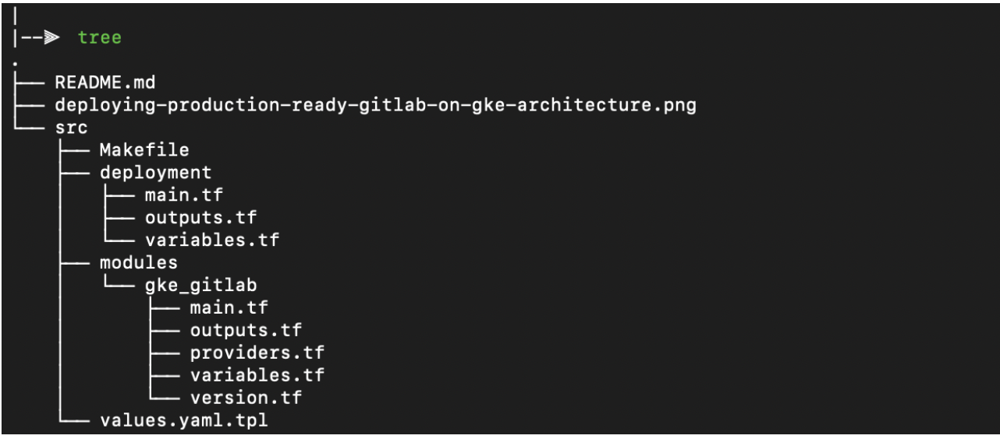

# Deploy Gitlab production grade on GKE

This Terraform configuration creates a scalable, reliable, and observable GitLab instance on Google Kubernetes Engine (GKE)  as the computing environment and the following services for storing
data:
- CloudSQL for PostgreSQL
- Memorystore for Redis
- Cloud Storage


## Deployment

```
module "gitlab" {
  source              = "../modules/gke_gitlab"
  project_id                 = var.project_id
  certmanager_email          = var.certmanager_email
}
```

Then perform the following commands on the root folder:

- `terraform init` to get the plugins
- `terraform plan` to see the infrastructure plan
- `terraform apply` to apply the infrastructure build

## Testing/Deletion
If you are interested in testing, and/or want to delete all the resources, add the following flag to your terraform apply `-var="deletion_protection=false"`.  You should be able to add this flag after the fact.

[^]: (autogen_docs_start)

## Inputs

| Name | Description | Type | Default | Required |
|------|-------------|:----:|:-----:|:-----:|
| certmanager\_email | Email used to retrieve SSL certificates from Let's Encrypt | string | n/a | yes |
| gitlab\_db\_password | Password for the GitLab Postgres user | string | `""` | no |
| project\_id | GCP Project to deploy resources | string | n/a | yes |
| region | GCP region to deploy resources to | string | `"us-central1"` | no |
| deletion_protection | Allow Deletion of protected resources | string | true | no |

## Outputs

| Name | Description |
|------|-------------|
| gitlab\_url | URL where you can access your GitLab instance |
| root\_password\_instructions | Instructions for getting the root user's password for initial setup |

[^]: (autogen_docs_end)

### Software Dependencies
### Terraform
- [Terraform](https://www.terraform.io/downloads.html) 1.0.x
- [terraform-provider-google](https://github.com/terraform-providers/terraform-provider-google) plugin v1.8.0

### Before you begin
1. [Sign in](https://accounts.google.com/Login) to your Google Account. If you don't have one, [sign up for a new account](https://accounts.google.com/SignUp).
2. In the Cloud Console, on the project selector page, select or create a Cloud project. [Click here to goto the Project Selector page](o to the project selector page)
3. Make sure that billing is enabled for your Google Cloud project.  [Learn how to confirm billing is enabled on your project](https://cloud.google.com/billing/docs/how-to/modify-project).

#### Note:
If you don't want to keep the resources for the project. Create a new project and when your done delete the project. This will remove all of the resources associated with the project.

## Prerequisits
### Terraform
Be sure you have the correct Terraform version (1.x.x), you can choose the binary here:
- https://releases.hashicorp.com/terraform/

### gcloud command-line tool
If you would rather use command line tool instead of the Cloud Shell here is some additional [information] (https://cloud.google.com/sdk/gcloud/)

## Creating prerequisite resources
1. Open Cloud Shell: [Open Cloud Shell](https://console.cloud.google.com/cloudshell/).
2. In Cloud Shell, enable the Google Kubernetes Engine, Service Networking, Resource Manager, and Redis APIs:

```
gcloud config set project VALUE

gcloud services enable \ container.googleapis.com \
servicenetworking.googleapis.com \
cloudresourcemanager.googleapis.com \
redis.googleapis.com
```

## File structure
The project has the following folders and files:



1. /deployment: Terraform deployment execution
2. main.tf: main file for this module, contains all the resources to create
3. variables.tf: all the variables for the module
4. output.tf: the outputs of the module
5. providers.tf: project providers (gcp, kubernetes, helm)
6. versions.tf: required versions
7. /values.yaml.tpl: Helm values. Learn more about values in helm

## resources
For additional information[ Read This ](https://aymen-segni.com/index.php/2020/02/10/deploy-production-grade-gitlab-on-gke-with-terraform-and-helm/)
